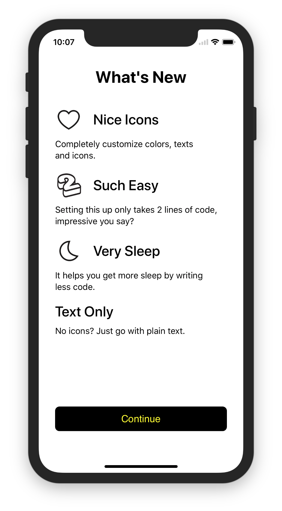

# WhatsNew

[](https://circleci.com/gh/BalestraPatrick/WhatsNew)
[](http://cocoapods.org/pods/WhatsNew)
[](http://cocoapods.org/pods/WhatsNew)
[](http://cocoapods.org/pods/WhatsNew)

<p align="center"></p>

## Description
`WhatsNew` automatically displays a short description of the new features when users update your app. This is similar to what happens in Apple's apps like Pages, Numbers, Keynote, iMovie and TestFlight. 

Simply list your new features (with optional icons), customize the appeareance and when to show it (only on major updates for example).

## Usage
Run the example project from the `Example` directory and check out `ViewController.swift`.

```swift
import WhatsNew

let whatsNew = WhatsNewViewController(items: [
	WhatsNewItem.image(title: "Nice Icons", subtitle: "Completely customize colors, texts and icons.", image: #imageLiteral(resourceName: "love")),
	WhatsNewItem.image(title: "Such Easy", subtitle: "Setting this up only takes 2 lines of code, impressive you say?", image: #imageLiteral(resourceName: "threed")),
	WhatsNewItem.image(title: "Very Sleep", subtitle: "It helps you get more sleep by writing less code.", image: #imageLiteral(resourceName: "night")),
	WhatsNewItem.text(title: "Text Only", subtitle: "No icons? Just go with plain text."),
])
whatsNew.presentIfNeeded(on: self)
```

Some of the apps using `WhatsNew` in production are:
- [Blocknow](https://itunes.apple.com/app/blocknow/id1350568499)
- [Bittracker](http://appstore.com/BittrackerCryptoCoinTracker)

If you're using `WhatsNew` in your app, please let me know and I will make sure to add it to the list of apps that use this library! 

## Customizations
There are a bunch of customizable properties with relative documentation.

```swift
/// Defines when to present the What's New view controller. Check the `PresentationOption` enum for more details.
public var presentationOption: PresentationOption = .always

/// Closure invoked when the user dismisses the view controller.
public var onDismissal: (() -> Void)?

/// Text of the top title.
public var titleText: String = "What’s New"

/// Color of the top title.
public var titleColor: UIColor = .black

/// Font of the top title.
public var titleFont: UIFont = UIFont.systemFont(ofSize: 26, weight: .bold)

/// Title color of the feature items.
public var itemTitleColor: UIColor = .black

/// Subtitle color of the feature items.
public var itemSubtitleColor: UIColor = .black

/// Title font of the feature items
public var itemTitleFont: UIFont = UIFont.systemFont(ofSize: 20, weight: .bold)

/// Subtitle font of the feature items
public var itemSubtitleFont: UIFont = UIFont.systemFont(ofSize: 16, weight: .regular)

/// Text of the bottom button that dismisses the view controller.
public var buttonText: String = "Continue"

/// Text color of the bottom button that dismisses the view controller.
public var buttonTextColor: UIColor = .yellow

/// Text font of the bottom button that dismisses the view controller.
public var buttonFont: UIFont = UIFont.systemFont(ofSize: 16, weight: .regular)

/// Background color of the bottom button that dismisses the view controller.
public var buttonBackgroundColor: UIColor = .black
```

## Installation

`WhatsNew` is available through [CocoaPods](http://cocoapods.org). To install
it, simply add the following line to your `Podfile`:

```ruby
pod 'WhatsNew'
```

You can also use [Carthage](https://github.com/Carthage/Carthage) if you prefer. Add this line to your `Cartfile`.

```ruby
github "BalestraPatrick/WhatsNew"
```

Android version available [here](https://github.com/TonnyL/WhatsNew).
## Requirements
iOS 9.0 and Swift 4.0 are required.

## Author

I'm [Patrick Balestra](http://www.patrickbalestra.com).
Email: [me@patrickbalestra.com](mailto:me@patrickbalestra.com)
Twitter: [@BalestraPatrick](http://twitter.com/BalestraPatrick).

## License

`WhatsNew` is available under the MIT license. See the [LICENSE](LICENSE) file for more info.
